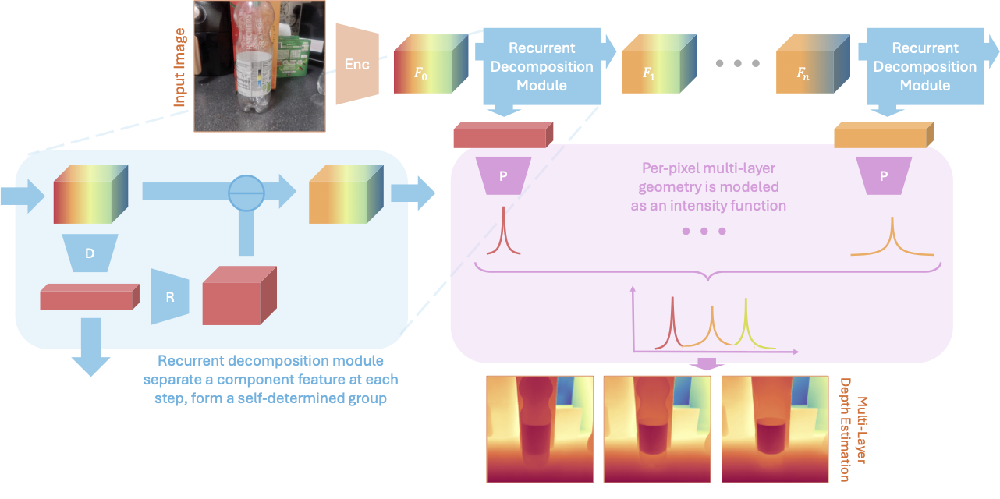

# [CVPR 2026] SeeGroup: Multi-Layer Depth Estimation of Transparent Surfaces via Self-Determined Grouping



In this work, we propose SeeGroup, a multi-layer depth estimation method that allows the model itself to adaptively assign surfaces to depth maps. We formulate per-pixel multi-layer depth as a point process, treating depth layers as unordered events along each camera ray. This induces a permutation-invariant likelihood over the observed depth layers, yielding a loss that naturally supports arbitrary layer groupings. Experiments demonstrate that our method significantly advances the state of the art of multi-layer depth estimation, improving quadruplet relative depth accuracy on LayeredDepth benchmark from 61.34% to 70.09%. 

If you find SeeGroup useful for your work, please consider citing our academic paper:

<h3 align="center">
    <a href="https://arxiv.org/abs/2605.28735">
        SeeGroup: Multi-Layer Depth Estimation of Transparent Surfaces via Self-Determined Grouping
    </a>
</h3>
<p align="center">
    <a href="https://hermera.github.io">Hongyu Wen</a>, 
    <a href="https://www.cs.princeton.edu/~jiadeng/">Jia Deng</a><br/>
</p>

```
@misc{wen2026seegroupmultilayerdepthestimation,
      title={SeeGroup: Multi-Layer Depth Estimation of Transparent Surfaces via Self-Determined Grouping}, 
      author={Hongyu Wen and Jia Deng},
      year={2026},
      eprint={2605.28735},
      archivePrefix={arXiv},
      primaryClass={cs.CV},
      url={https://arxiv.org/abs/2605.28735}, 
}
```

## Setup
Install dependencies:
```bash
pip install -r requirements.txt
```

Download the released SeeGroup checkpoint for validation and test prediction:

```bash
bash scripts/download_seegroup_checkpoint.sh
```


## Validation

Evaluate SeeGroup on LayeredDepth validation split with the released checkpoint:

```bash
python val.py --checkpoint-path checkpoints/seegroup.pth
```

## Test 

Run SeeGroup on LayeredDepth validation split with the released checkpoint and save the predictions:

```bash
python test.py \
  --checkpoint-path checkpoints/seegroup.pth \
  --output-dir predictions/layereddepth_test \
  --format npy
```

## Training

Before training, download the DAV2 backbone once:

```bash
bash scripts/download_dav2_checkpoint.sh
```

Run single-GPU training:

```bash
python train.py
```

Run multi-GPU training on one machine:

```bash
torchrun --nproc_per_node=$gpus train.py
```

## Acknowledgement 

This project relies on code from [Depth-Anything-V2](https://github.com/DepthAnything/Depth-Anything-V2). We thank the original authors for their excellent work.